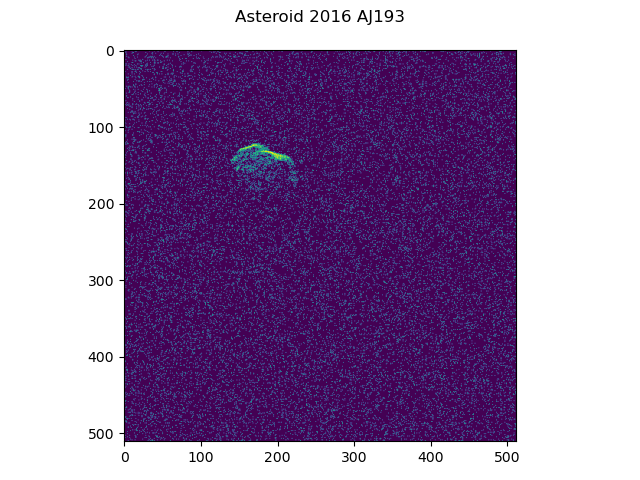

# AsteroidGrapher
Using binary radio telescope data, I plotted one angle of [Asteroid 2016 AJ193](https://www.jpl.nasa.gov/images/radar-reveals-the-surface-of-asteroid-2016-aj193).

Below are the plots that I made:

